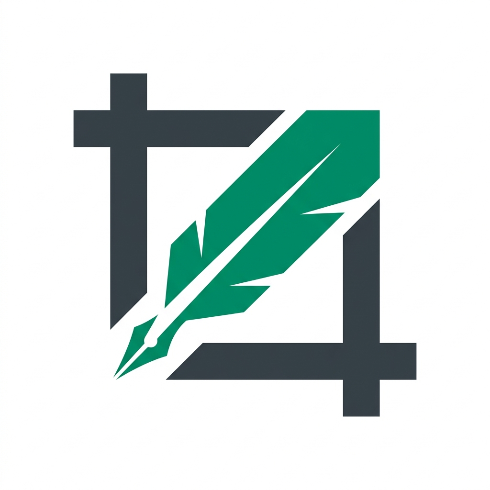

# ScribeCrop

**High-efficiency dataset annotation and image region extraction.**

ScribeCrop was born out of frustration with standard image editing utilities. When annotating large datasets, tools like the Snipping Tool, Paint, or Windows Photos fail to keep up. They are designed for one-off edits, not high-volume production. 

ScribeCrop solves the three biggest bottlenecks in manual dataset preparation:
1. **Single-Crop Fatigue**: Instead of opening and saving a file for every single word, ScribeCrop allows you to map out every region on a single image and export them all in one click.
2. **Naming Friction**: Forget typing `word_01`, `word_02`, `word_03` manually. ScribeCrop handles sequential naming automatically with custom prefixes and start indices.
3. **Scaling & Precision**: Generic tools often struggle with consistent scaling and high-precision selection. ScribeCrop provides sub-pixel accuracy with interactive handles and automated workspace scaling.

---

<p align="center">
  
</p>

## Core Capabilities

- **🚀 Bulk Extraction**: Draw rectangles, squares, circles, or complex polygons across your entire image.
- **⚡ Reactive Renaming**: Set a prefix and a start number; ScribeCrop re-indexes your entire collection instantly as you work.
- **🎯 Precision Reshaping**: Use professional transformer handles to fine-tune your crop areas after drawing them.
- **🔄 Universal Rotation**: Rotate documents or photos to any orientation without losing your coordinate space.
- **📦 ZIP Export**: One-button export that packages your entire session into a clean, labeled ZIP archive.
- **💎 Premium Aesthetic**: A tailored Emerald & Zinc interface designed for focus and tool-centric clarity.

## ScribeCrop Monorepo

A professional image word extractor and cropper, now available for both Web and Desktop.

## Project Structure

- `web/`: Next.js application (React, Konva, Lucide).
- `desktop/`: Electron wrapper for the desktop experience.

## Getting Started

1. **Install dependencies** (from the root):
   ```bash
   npm install
   ```

2. **Run Web Version**:
   ```bash
   npm run web:dev
   ```

3. **Run Desktop Version (Development)**:
   *First, start the web dev server in one terminal:*
   ```bash
   npm run web:dev
   ```
   *Then, launch Electron in another terminal:*
   ```bash
   npm run desktop:dev
   ```

4. **Build Desktop Version**:
   ```bash
   npm run build
   ```
   This will build the web static export and then package the Electron app into the `desktop/dist` folder.

## Scripts

- `npm run web:dev`: Start Next.js dev server.
- `npm run web:build`: Generate static export in `web/out`.
- `npm run desktop:dev`: Launch Electron pointing to local dev server.
- `npm run desktop:preview`: Launch Electron pointing to `web/out`.
- `npm run desktop:build`: Package the desktop app.
- `npm run build`: Full production build (Web + Desktop).

## Technology Stack

- **Core**: Next.js, React, TypeScript
- **Graphics**: Konva.js (Canvas API)
- **Desktop**: Electron, Electron Builder
- **Styling**: Vanilla CSS Modules
- **Icons**: Lucide React

---

*Designed for researchers, developers, and data scientists who value their time.*
